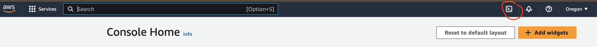
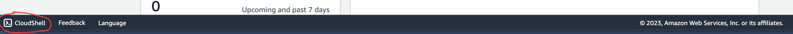
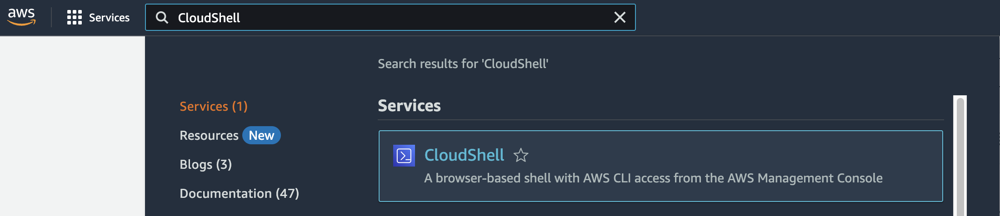
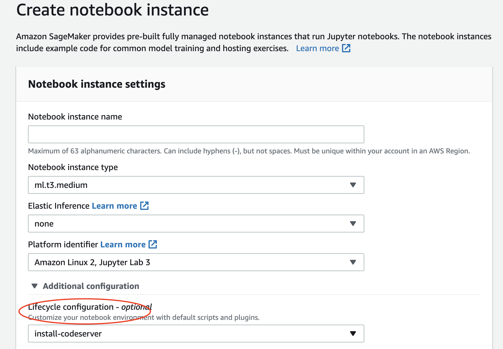

# SageMaker Notebook Instance Setup

## Install CodeServer

创建 LifeCycle Configuration，在create新实例和启动实例时安装和配置code-server

Reference: https://aws.amazon.com/blogs/machine-learning/host-code-server-on-amazon-sagemaker/

### Steps

1. 以SageMaker管理员权限登入AWS 控制台，打开CloudShell
    1. 位于右上角，左下角，或在服务中搜索
    2. 作用相当于云上Linux虚拟机的Terminal，享有当前登入控制台IAM 用户或角色的权限







2. 下载code-server安装配置脚本，并创建lifecycle configuration
   * 创建完成后可在控制台中检查脚本：[SageMaker → Lyfecycle configurations -> Notebook instance -> install-codeserver](https://us-west-2.console.aws.amazon.com/sagemaker/home?region=us-west-2#/lifecycle-configurations/notebook/install-codeserver/detail)

```
curl -LO https://github.com/aws-samples/amazon-sagemaker-codeserver/releases/download/v0.1.5/amazon-sagemaker-codeserver-0.1.5.tar.gz
tar -xvzf amazon-sagemaker-codeserver-0.1.5.tar.gz

cd amazon-sagemaker-codeserver/install-scripts/notebook-instances

aws sagemaker create-notebook-instance-lifecycle-config \
    --notebook-instance-lifecycle-config-name install-codeserver \
    --on-start Content="$((cat setup-codeserver.sh || echo "")| base64)" \
    --on-create Content="$((cat install-codeserver.sh || echo "")| base64)"
```

3. 创建新实例，关联lifecycle configuration
    1. 在新实例创建并启动后，可看到CodeServer已成功安装
    2. 在实例停止并重启后，可看到CodeServer依然安装在实例上



4. 如需为已创建的实例关联lifecycle configuration，需先在本机安装code-server
    1. 停止实例，等待状态变为已停止
    2. 编辑实例，关联install-codeserver lifecycle configuration
    3. 启动实例，在launcher中看到code-server图标，但此时打开会报错500
    4. 打开Terminal，安装code-server，再打开code-server图标，可以成功连接

```
curl -LO https://github.com/aws-samples/amazon-sagemaker-codeserver/releases/download/v0.1.5/amazon-sagemaker-codeserver-0.1.5.tar.gz 
tar -xvzf amazon-sagemaker-codeserver-0.1.5.tar.gz 

cd amazon-sagemaker-codeserver/install-scripts/notebook-instances

chmod +x install-codeserver.sh 
chmod +x setup-codeserver.sh sudo 
./install-codeserver.sh sudo 
./setup-codeserver.sh`
```

Alternative：先安装code-server，关联lifecycle configuration
